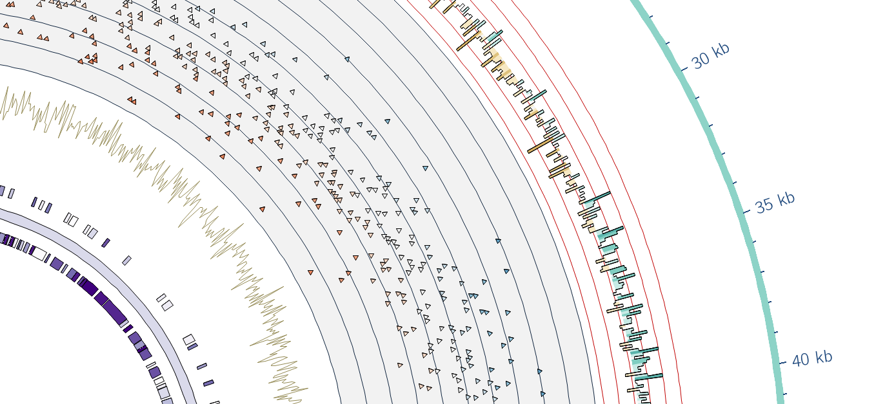

Galaxy Circos Tool
==================

Features
--------

-  [x] Ideograms

   -  [x] Can configure most aspects of these. More features on demand

-  [x] 2d Data sources

   -  [x] Histograms

      -  [x] Stacked histograms
      -  [x] gff3 scores
      -  [x] wig files
      -  [x] bed
      -  [x] Rules

         -  [x] Complex colouring rules

   -  [ ] Heatmaps

      -  [ ] Bugs here.

   -  [x] Tiles
   -  [x] Scatter Plots
   -  [x] Line Plots

-  [x] Links
-  [x] Axes
-  [x] Backgrounds
-  [ ] Highlights

   -  [ ] Wedge

-  [x] Test cases
-  [ ] Grids?
-  [ ] Fine grained Z-depth control

Scripts
-------

fasta-to-karyotype.py
~~~~~~~~~~~~~~~~~~~~~

script to generate the karyotype file and append cytogenetic bands (when supplied.)

**Usage**:

    python fasta-to-karyotype.py fasta-file [cytogenetic-band-file]

**Inputs**:

For the fasta file, this looks as normal.::

    >ctgA
    ...
    >ctgB
    ...

And the bands should be provided in BED3/6/9/12 format.::

    ctgA   0     500     p1   960   +   0     0     0,255,0
    ctgA   500   50001   p2   900   -   500   500   0,0,255
    ctgB   0     6079    p3   900   -   0     0     255,0,255

**Outputs**

On stdout::

    #     chr id 0 length color
    chr - ctgA 0 0 50001 set3-12-qual-1
    chr - ctgB 1 0 6079 set3-12-qual-2

    #    chr        start   end     color
    band ctgA p1 p1 0       500     gx-karyotype-1
    band ctgA p2 p2 500     500001  gx-karyotype-2
    band ctgB p3 p3 0       6079    gx-karyotype-3

On stderr::

    gx-karyotype-1 = 0,255,0
    gx-karyotype-2 = 0,0,255
    gx-karyotype-3 = 255,0,255
