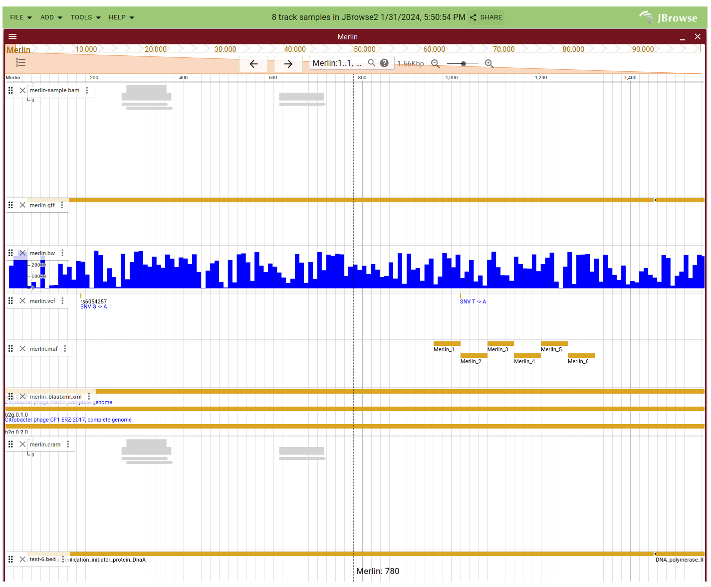

JBrowse2 in Galaxy
==================

    JBrowse2 is a fast, embeddable genome browser built completely with
    JavaScript and HTML5

Added Mar 8:
 - URI as data source for tracks
 - Autogenerate from a collection now builtin to advanced options - ignores form
    - potentially thousands of tracks without filling in any form...
 - Cram now working
 - Multigenome pafs from mashmap working properly..
 - TODO reuse code for references for paf references to allow URI and builtin genomes

Added Mar 3:
 - optional tracks at last for JB2
 - dotted noodles from optional inputs now ignored without harm
 - autogenJB2.
    - Takes a collection of bam/vcf etc and turns them into tracks in a normal JB2 history item.
    - Uses the JbrowseConnector, but the XML tool drives it from the contents of the collection.
    - Collection can be built from any source or with optional noodles in a WF
    - Produces a JB2 with all available tracks.
    - Argparse command line with repeats for tracks and references
        - so works outside Galaxy to process directories or s3 buckets.

Added Feb 3: cool/mcool -> hic

.. image:: dm4_in_jb2.png

Other tracks

JBrowse2 is a fast, embeddable genome browser built completely with
JavaScript and HTML5

Makes an ideal fit with Galaxy, especially for use as a
workflow summary. E.g. annotate a genome, then visualise all of the
associated datasets as an interactive HTML page. This tool MUST be whitelisted
(or ``sanitize_all_html=False`` in galaxy.ini) to function correctly.
The built-in Galaxy gunicorn server does not support byte range requests, so this tool must be proxied by nginx
or another web server, correctly configured to support range requests. A tiny web server is bundled
with each JBrowse2 archive - see below.

Installation
============

This wrapper is normally installed by a server administrator from the Galaxy Tool Shed IUC JBrowse2 repository.

Local display
=============

Each JBrowse2 history item can be downloaded ("floppy disk" icon) to your local disk. There, it can be unzipped into a new directory.
That directory includes a python script, *jb2_webserver.py* that will run a local web server able to serve byte range requests,
giving the same view as seen when viewed from the Galaxy history.

From the newly unzipped directory where that file can be found, and with Python3 installed and working,

`python3 jb2_webserver.py`

will open the preconfigured browser using the default web browser application.

That webserver code is separately under the Apache 2 license copied in this repository. See below for this code's MIT license.

History
=======

- 2.10.0+galaxy2

    - UPDATED existing JBrowse1.16.11 code to JBrowse 2.10.0
    - was working well enough for VGP when previous PR discovered
        - too late to backport all the fixes
        - working default session and some other ideas copied instead.
    - seems to work well with defaults.
    - need to document and implement track settings by running the browser locally.
    - works well enough to be useful in workflows such as TreeValGal.
    - JB2 seems to set defaults wisely.
    - not yet ideal for users who need fine grained track control.
    - synteny (paf + reference) now working
    - rehomed at https://github.com/usegalaxy-eu/temporary-tools/tree/master/jbrowse2 while IUC reviews are slowly sorted out.

Wrapper License (MIT/BSD Style)
===============================

Permission to use, copy, modify, and distribute this software and its
documentation with or without modifications and for any purpose and
without fee is hereby granted, provided that any copyright notices
appear in all copies and that both those copyright notices and this
permission notice appear in supporting documentation, and that the names
of the contributors or copyright holders not be used in advertising or
publicity pertaining to distribution of the software without specific
prior permission.

THE CONTRIBUTORS AND COPYRIGHT HOLDERS OF THIS SOFTWARE DISCLAIM ALL
WARRANTIES WITH REGARD TO THIS SOFTWARE, INCLUDING ALL IMPLIED
WARRANTIES OF MERCHANTABILITY AND FITNESS, IN NO EVENT SHALL THE
CONTRIBUTORS OR COPYRIGHT HOLDERS BE LIABLE FOR ANY SPECIAL, INDIRECT OR
CONSEQUENTIAL DAMAGES OR ANY DAMAGES WHATSOEVER RESULTING FROM LOSS OF
USE, DATA OR PROFITS, WHETHER IN AN ACTION OF CONTRACT, NEGLIGENCE OR
OTHER TORTIOUS ACTION, ARISING OUT OF OR IN CONNECTION WITH THE USE OR
PERFORMANCE OF THIS SOFTWARE.
